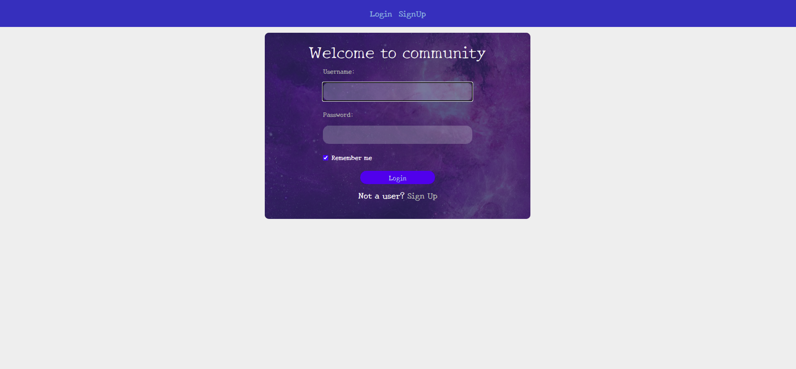
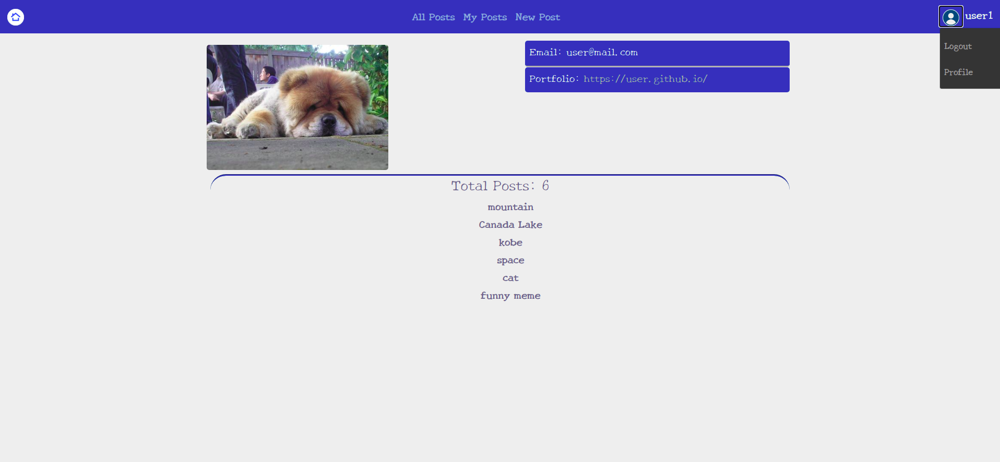
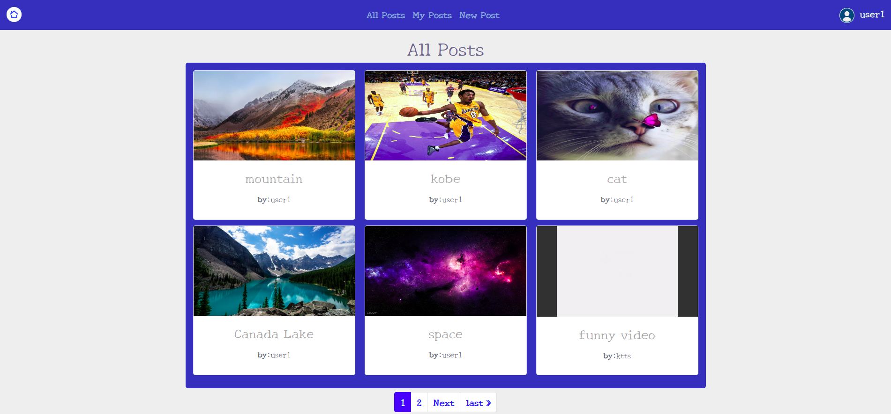
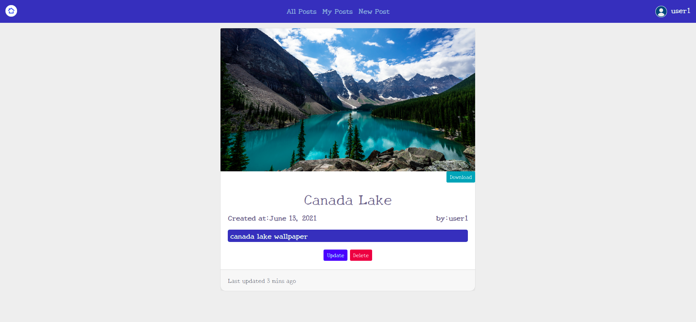

# Django community application (users and posts)
##### This application implements the following services
- user registration and login
- user profile management
- create, update, delete post
- view other users' posts
- posts pagination
- post type
   - tweet
   - image
   - video
   - file
- posts also can be downloaded
- application supports video playing   

##### The following services will be added in v2:
- groups of users
- search
- post like, dislike
- post commentary

### Build and deployment
##### Application can be deployed on
- python virtualenv
```bash
virtualenv -p /usr/bin/python3.8 venv #create venv
source venv/bin/activate #activate venv
pip install -r requirements.txt #install packages to venv
python manage.py runserver 0.0.0.0:10000 #run your project
```

- docker
```bash
sh run.sh
```
- docker in production
```bash
sh run-prod.sh
```

### Application screenshots
Login:


Index:


Posts:


Single post:

